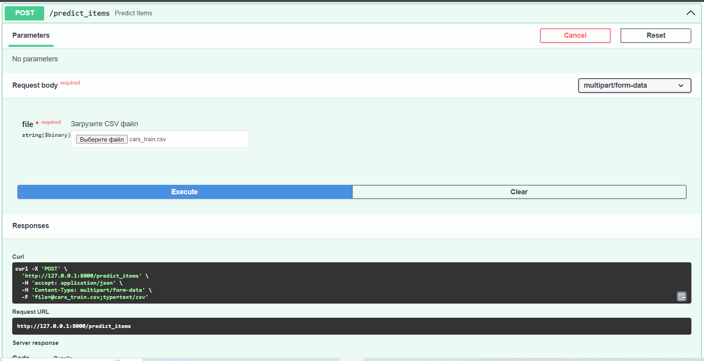
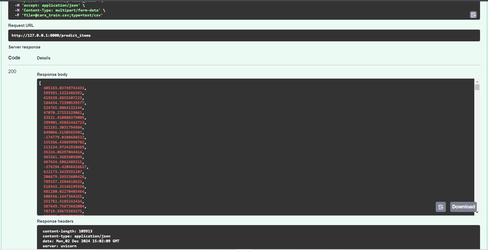

# Ml_Hw1

## Первое домашнее задание по курсу ML.
Описание файлов:
1. Копия_блокнота__AI_HW1_Regression_with_inference_base_ipynb_ (3) - ноутбук со всеми проведёнными экспериментами
2. my_report - сохраненный дашборд в формате html
3. model.pkl - сохранённая модель в pickle
4. onehotencoder.pkl - сохранённый обученный OneHotEncoder в pickle
5. simpleimputer.pkl - сохранённый SimpleImputer в pickle
6. standartscaler.pkl - сохранённый StandardScaler в pickle
7. servis.py - сервис FastApi
8. requirements.txt - файл зависимостей
9. скриншоты/ - папка с скриншотами работы сервиса
10. files/ - папка с csv файлами для проверки работы сервиса

### Выводы по проделанной работе:
Был проведен EDA данных. Рассмотрены визуализации, заполнены пропуски медианным значением, преобразованы категориальные столбцы, отброшены ед. измерения в некоторых столбцах. Были обнаружены некоторые зависимости в данных, мы выяснили, что больше всего на прогноз моделей влияет max_power.

Применены разные модели(Lasso, Ridge, ElascitNet) к данным. Подобраны гиперпараметры с помощью GridSearch.

Посчитана бизнес метрика - Среди всех предсказанных цен на авто нужно посчитать долю прогнозов, отличающихся от реальных цен на эти авто не более чем на 10% (в одну или другую сторону). Найдена лучшаа модель по этой метрике(она же просто лучшая модель)

Результатов удалось добиться средних. Вероятно из-за простоты модели. Скорее всего более сложные модели показали бы лучший результат. Также можно ещё лучше обработать данные.

Наибольший буст в качестве дало использование максимального количества столбцов. Т.е. качество улучшилось после того как я закодировал категориальные переменные и использовал их.

Cделан с помощью FastAPI сервис, который с точки зрения пользователя реализует две функции:
1. на вход в формате json подаются признаки одного объекта, на выходе сервис выдает предсказанную стоимость машины
2. на вход подается csv-файл с признаками тестовых объектов, на выходе получаем список предсказаний

С точки зрения реализации это означает следующее:
1. средствами pydantic должен быть описан класс базового объекта
    класс с коллецией объектов
2. метод post, который получает на вход один объект описанного класса
3. метод post, который получает на вход csv файл из объектов описанного класса

# Результаты работы сервиса можно посмотреть запустив сам сервис, а так же на приложенных скриншотах.
1. Запрос к сервису на предсказание одного объекта

1. Ответ сервиса с предсказанием цены одного объекта

3. Запрос к сервису на предсказание csv файла

4. Ответ сервиса с предсказанием списка объектов

